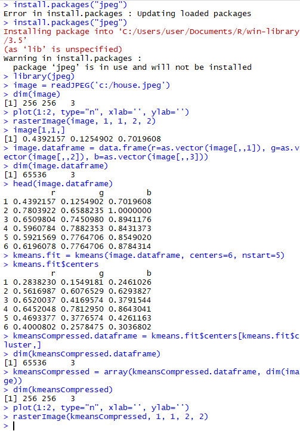

Clustering Algorithm

홍준성 Hong JuneSung

April 26, 2019

1.  **Introduction**

> Cluster analysis or clustering is the task of grouping a set of
> objects in such a way that objects in the same group (called a
> cluster) are more similar (in some sense) to each other than to those
> in other groups (clusters). It is a main task of exploratory data
> mining, and a common technique for statistical data analysis, used in
> many fields, including machine learning, pattern recognition, image
> analysis, information retrieval, bioinformatics, data compression, and
> computer graphics.
>
> The notion of a \"cluster\" cannot be precisely defined, which is one
> of the reasons why there are so many clustering algorithms. There is a
> common denominator: a group of data objects. However, different
> researchers employ different cluster models, and for each of these
> cluster models again different algorithms can be given. The notion of
> a cluster, as found by different algorithms, varies significantly in
> its properties. Understanding these \"cluster models\" is key to
> understanding the differences between the various algorithms.

2.  **Data description**

> I downloaded the image 'house.ppm' to use from
> website( [[http://cs.joensuu.fi/sipu/datasets/]{.underline}](http://cs.joensuu.fi/sipu/datasets/)).
>
> Later, I converted the file format ppm to a jpeg on
> website([[https://convertio.co/kr/ppm-jpeg/]{.underline}](https://convertio.co/kr/ppm-jpeg/))
> because the ppm format file was new to me.
>
> And then I can get 'house.jpeg' file.

{width="3.5520833333333335in"
height="3.5520833333333335in"}

(house.jpeg)

3.  **Description of the selected method**

> Centroid models: for example, the k-means algorithm represents each
> cluster by a single mean vector.

K-means clustering uses a non-hierarchical clustering method, which
gives you the advantage of fast processing of large volumes of data
because of its small calculations.

The algorithms of K-means clustering are as follows:

Randomly select the K cluster center set by the analyst

Assign an observation to the nearest cluster center and calculate a new
cluster center

> Repeat until existing and newly calculated cluster centers are equal
>
> And I also used the program R studio

The image is made up of units called pixels, and each of these three
colors, Red, Green, and Blue, have a value of 8 bits per pixel to
complete the 24 bits True Color.

Of course, for black and white pictures in gray scale, the pixels will
be configured with just 8 bits (0-255). The figure is then a dataset
with three-dimensional values (r, g, b).

If these colors are extracted with K clusters, they can be tied together
with similar colors.

> In addition, segmentation allows information to be sent in a reduced
> scale of 1 to K index instead of 24 bits per pixel.

4.  **Results**

> {width="3.1496062992125986in"
> height="4.003937007874016in"}
>
> (the original picture)
>
> {width="3.1496062992125986in"
> height="4.003937007874016in"}
>
> (after clustering picture)

5.  **Codes**
```r
install.packages(\"jpeg\")

#(Installing a library for loading images)

library(jpeg)

#(load library)

image = readJPEG(\'c:/house.jpeg\')

#(Bring in an image and put it in a variable.)

dim(image)

#(You can see that Dimension is X by X 3 (rgb).)

plot(1:2, type=\"n\", xlab=\'\', ylab=\'\')

#(I made an empty plot.)

rasterImage(image, 1, 1, 2, 2)

#(Load the image to the desired size.)

image\[1,1,\]

#(Check the rgb value of the pixel(1,1).)

image.dataframe = data.frame(r=as.vector(image\[,,1\]),
    g=as.vector(image\[,,2\]), b=as.vector(image\[,,3\]))

# (Now the data has been transformed to apply K-means clustering.
#
# Since the concept of horizontal or vertical in segmentation was
# meaningless anyway, it was transformed into a one-dimensional vector
# and transformed into a three-dimensional data type of (r, g, b).)

   dim(image.dataframe)

# (Verifies that the exact number of data samples is equal to the number
# of pixels)

   head(image.dataframe)

# (Check only the first part using the head function)

   kmeans.fit = kmeans(image.dataframe, centers=6, nstart=5)

# (These pixels were separated by a cluster of random numbers (K=6).)

   kmeans.fit\$centers

#(Then, check what these segmented pixels look like.

# To do so, the data is restored to the original array format.)

   kmeansCompressed.dataframe =
    kmeans.fit\$centers\[kmeans.fit\$cluster,\]

# (each pixel\'s data is filled with the data from the pentroid.)

   dim(kmeansCompressed.dataframe)

   kmeansCompressed = array(kmeansCompressed.dataframe, dim(image))

# (Move the dataframe type back to the array format.)

   dim(kmeansCompressed)

# (Confirmation that it is again in the form of (street, vertical, 3))

   plot(1:2, type=\"n\", xlab=\'\', ylab=\'\')

   rasterImage(kmeansCompressed, 1, 1, 2, 2)

# (get the result picture)
#


```

> (source code picture)

